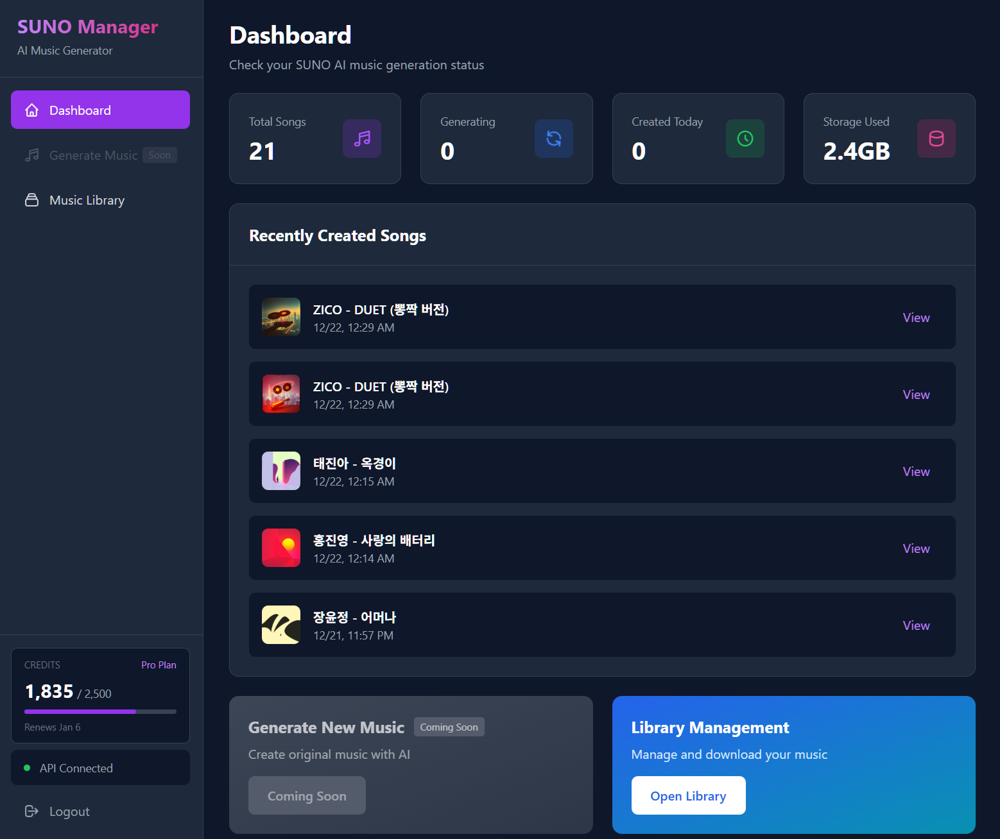
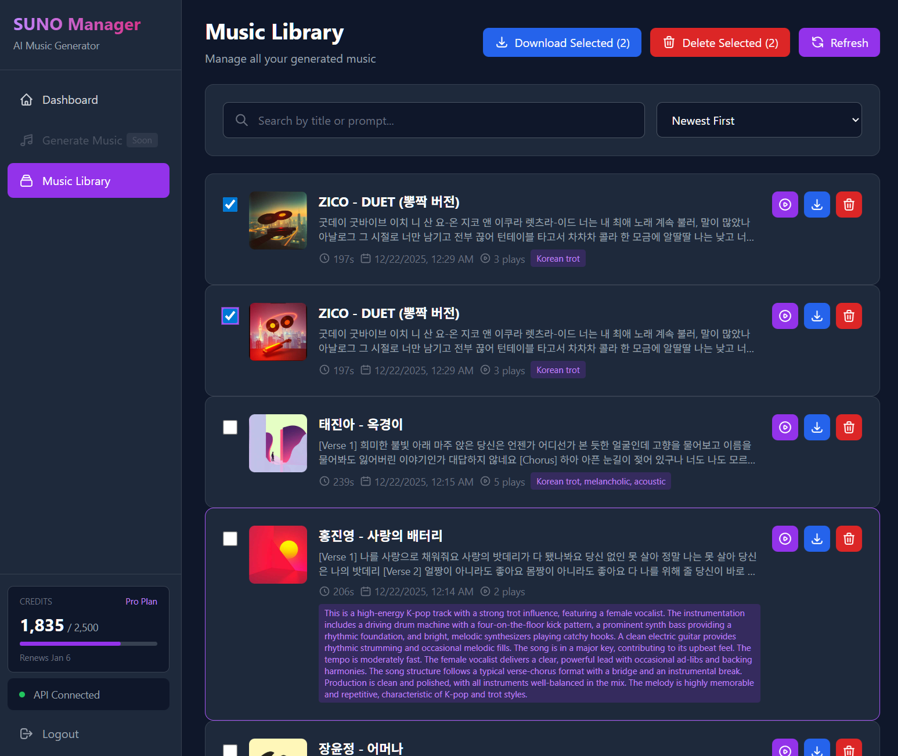

# SUNO Manager

[English](README_EN.md) | 한국어

SUNO API를 활용한 모던한 음악 생성 및 관리 웹 애플리케이션입니다.

## 스크린샷

### 대시보드


### 음악 라이브러리


## 주요 기능

- **로그인**: SUNO Bearer 토큰(JWT)을 사용한 인증
- **대시보드**: 생성된 음악 통계 및 최근 곡 목록 확인
- **음악 생성**: AI 프롬프트를 통한 음악 생성 *(예정)*
- **음악 라이브러리**: 생성된 음악 관리, 재생, 다운로드, 삭제
- **전역 오디오 플레이어**: 이퀄라이저 애니메이션이 포함된 하단 고정 플레이어
- **가사 보기**: 곡 가사/프롬프트 팝업 표시
- **일괄 다운로드**: 선택한 곡들을 ZIP 파일로 다운로드
- **일괄 삭제**: 선택한 곡들을 한번에 삭제
- **크레딧 정보**: 실시간 크레딧 및 구독 정보 표시

## 기술 스택

- **Backend**: Flask 3.0
- **Frontend**: Tailwind CSS (다크 모드)
- **API**: SUNO Studio API (실제 API 연동)

## 프로젝트 구조

```
suno-manager/
├── main.py                 # Flask 애플리케이션 메인 파일
├── suno_api.py            # SUNO API 클라이언트
├── templates/             # HTML 템플릿
│   ├── base.html         # 기본 레이아웃 (전역 플레이어 포함)
│   ├── login.html        # 로그인 페이지
│   ├── dashboard.html    # 대시보드 페이지
│   ├── generate.html     # 음악 생성 페이지
│   └── library.html      # 라이브러리 페이지
├── static/               # 정적 파일
├── downloads/            # 다운로드된 음악 파일
├── .env                  # 환경 변수
├── .env.example          # 환경 변수 예시
└── README.md
```

## 설치 및 실행

### 1. 패키지 설치

필요한 Python 패키지를 설치합니다:

```bash
pip install Flask requests python-dotenv
```

### 2. 환경 변수 설정

`.env.example` 파일을 `.env`로 복사하고 실제 값으로 수정:

```bash
cp .env.example .env
```

`.env` 파일에서 다음 값을 설정:

```
SUNO_BEARER_TOKEN=your_actual_bearer_token
SECRET_KEY=your_random_secret_key
```

### 3. SUNO Bearer 토큰 가져오기

1. [SUNO 웹사이트](https://suno.com)에 로그인
2. 브라우저 개발자 도구 열기 (F12)
3. **Network** 탭 선택
4. 페이지 새로고침 (F5)
5. 요청 목록에서 `feed/v3` 요청 클릭
6. **Request Headers**에서 `authorization` 헤더 찾기
7. `Bearer eyJhbGciOiJSUzI1NiIs...` 값에서 `Bearer ` 뒤의 토큰만 복사
8. `.env` 파일의 `SUNO_BEARER_TOKEN`에 붙여넣기

> **참고**: Bearer 토큰은 약 1시간마다 만료됩니다. 401 에러가 발생하면 새 토큰을 가져오세요.

또는 애플리케이션 실행 후 로그인 페이지에서 직접 입력할 수도 있습니다.

### 4. 애플리케이션 실행

```bash
python main.py
```

브라우저에서 `http://localhost:5000` 접속

## 사용 방법

### 로그인

1. 브라우저에서 `http://localhost:5000` 접속
2. SUNO Bearer 토큰 입력 (JWT 토큰)
3. 로그인 버튼 클릭

### 대시보드

- 전체 곡 수, 생성 중인 곡, 오늘 생성된 곡 통계 확인
- 최근 생성된 곡 5개 미리보기
- 크레딧 정보 및 구독 상태 확인

### 음악 라이브러리

- 생성된 모든 음악 목록 확인
- 검색 및 정렬 기능 (제목, 날짜)
- 각 곡에서 다음 작업 가능:
  - **재생**: 하단 플레이어에서 음악 재생
  - **가사**: 가사/프롬프트 팝업 표시
  - **다운로드**: MP3 파일 다운로드
  - **삭제**: 음악 삭제
- 일괄 다운로드: 여러 곡 선택 후 ZIP 파일로 다운로드
- 일괄 삭제: 여러 곡 선택 후 한번에 삭제

### 음악 생성 *(예정)*

> 이 기능은 현재 개발 중입니다.

- 프롬프트 입력하여 음악 생성
- 장르, 분위기, 템포 등 고급 옵션 설정
- 예제 프롬프트 제공

## API 엔드포인트

### 인증

```http
POST /login
Content-Type: application/json

{
  "token": "eyJhbGciOiJSUzI1NiIsImNhdCI6ImNsX0I3ZDRQRDExMUFBQSIs..."
}
```

### 크레딧 정보 조회

```http
GET /api/billing/info
```

### 곡 목록 조회

```http
GET /api/songs
GET /api/songs?cursor={next_cursor}
```

> Cursor 기반 페이지네이션을 사용합니다. 첫 요청은 cursor 없이, 이후 요청은 응답의 `next_cursor` 값을 사용합니다.

### 곡 삭제

```http
DELETE /api/songs/{song_id}
```

### 곡 다운로드

```http
GET /api/songs/{song_id}/download
```

### 일괄 다운로드

```http
POST /api/songs/batch-download
Content-Type: application/json

{
  "song_ids": ["id1", "id2", "id3"]
}
```

## 실제 SUNO API 연동

이 프로젝트는 실제 SUNO Studio API v3를 사용합니다:

- **API Endpoint**: `https://studio-api.prod.suno.com/api/feed/v3`
- **HTTP Method**: POST
- **인증 방식**: Bearer Token (JWT) + Browser Token (자동 생성)
- **페이지네이션**: Cursor 기반 (`next_cursor`, `has_more`)
- **응답 구조**: 실제 SUNO 응답 구조 사용 (`clips` 배열)

## 특징

- **실시간 데이터**: 실제 SUNO 계정의 음악 목록을 실시간으로 확인
- **전역 오디오 플레이어**: 페이지 이동 중에도 음악 재생 유지
- **이퀄라이저 애니메이션**: 현재 재생 중인 곡 시각화
- **앨범 커버**: SUNO에서 생성한 이미지 표시
- **재생 수 표시**: 각 곡의 재생 수 확인
- **태그 표시**: 장르/스타일 태그 표시
- **크레딧 정보**: 실시간 크레딧 잔액 및 구독 정보
- **세션 관리**: Flask 세션을 통한 토큰 관리

## 개발 환경

- Python 3.8+
- Flask 3.0
- Modern browsers (Chrome, Firefox, Safari, Edge)

## 보안 주의사항

- `.env` 파일을 절대 Git에 커밋하지 마세요
- Bearer 토큰은 민감한 정보이므로 안전하게 관리하세요
- Bearer 토큰은 일정 시간 후 만료되므로 주기적으로 갱신이 필요합니다
- 프로덕션 환경에서는 `SECRET_KEY`를 반드시 변경하세요

## 라이선스

MIT License

## 기여

이슈 및 풀 리퀘스트는 언제나 환영합니다!
