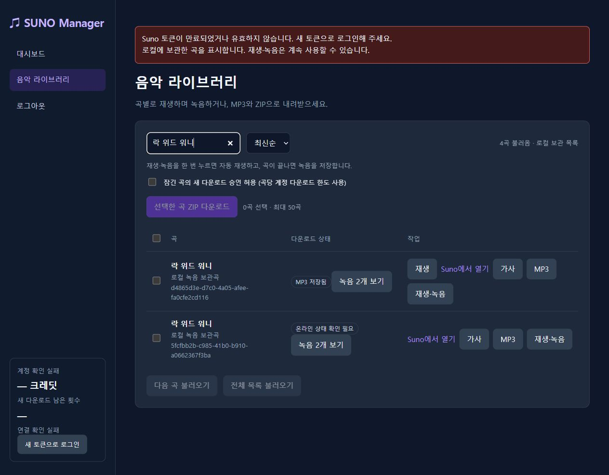
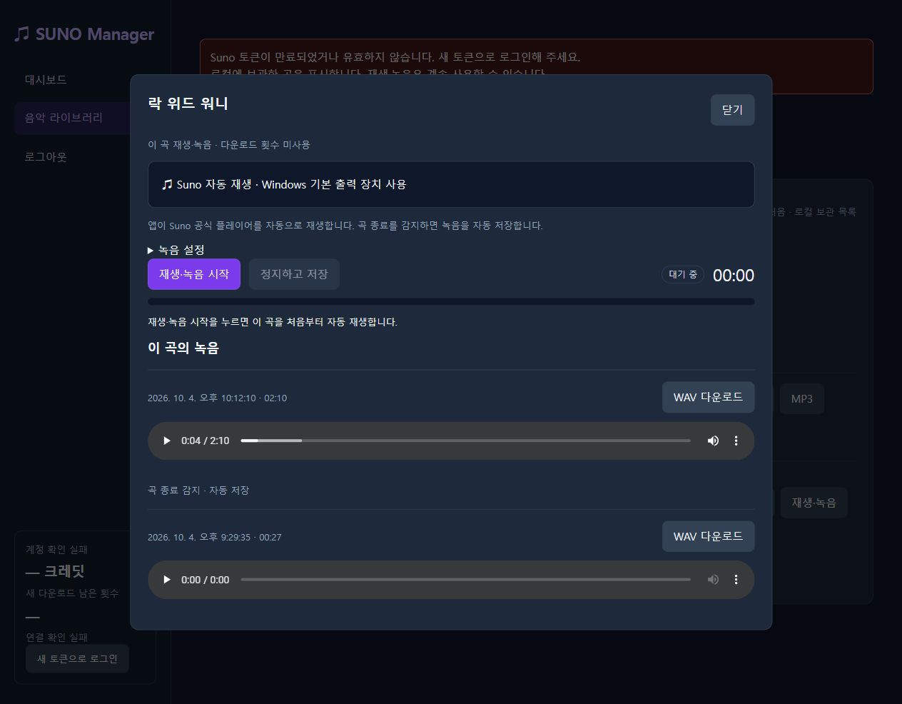

# SUNO Manager (Unofficial)

[English](README_EN.md) | 한국어

Suno의 개인 라이브러리를 조회하고 MP3를 저장하며, Windows 재생 소리를 WAV로 녹음하는 **비공식 로컬 Flask 앱**입니다.
Suno 웹 내부 API와 임베드 플레이어를 사용하며, Suno의 공식 제품이나 공식 API SDK가 아닙니다.

> **비공식 재생·녹음 안내**
>
> 이 프로젝트의 자동 재생·녹음은 **Unofficial 방식이며 Suno가 공식 지원하거나 권장하는 저장 방식이 아닙니다.**
> 2026-10-05에 확인한 [Suno 이용약관](https://suno.com/terms)의 “Permitted Commercial Use” 항목은
> Suno가 제공한 다운로드 경로 외의 복사를 금지하며, **녹음(recording)과 스트림 추출(stream ripping)을 명시적으로 금지**합니다.
> 녹음의 기술적 동작 확인은 Suno의 사용 허가를 의미하지 않습니다. 음원 저장은 Suno가 제공하는 다운로드 경로를 이용하세요.

2026-10-04에 실제 계정으로 목록 조회, 이미 잠금 해제한 곡의 직접 MP3 다운로드, ZIP 다운로드와 로컬 재생을 확인했습니다.

## 현재 지원 범위

| 기능 | 상태 |
| --- | --- |
| 토큰 로그인, 곡 목록·상세·가사 조회 | 지원 |
| 검색·정렬, 페이지별/전체 목록 조회 | 지원 |
| MP3 다운로드, 선택한 최대 50곡 ZIP | 지원 |
| 브라우저 없이 명령줄 다운로드 | 지원 |
| 저장된 MP3 재생 | 지원 |
| 다운로드 전 곡 재생 | 곡별 Suno 임베드 플레이어 |
| Windows 출력 오디오 녹음, WAV 재생·저장 | 비공식 자동 재생·녹음, 곡별 팝업 |
| Suno 원본 WAV·M4A·영상 내보내기 | 이 프로젝트에서 미지원 |

새 다운로드 승인 요청은 구현했으며 모의 테스트로 확인했습니다. 실제 계정 검증은 **이미 잠금 해제된 곡만** 사용했습니다.

## 화면 예시

2026-10-05에 현재 코드로 캡처한 실제 화면입니다. Suno 토큰이 만료되어 로컬 보관 목록을 표시한 상태이며,
녹음 결과는 2026-10-04의 검증 중 저장한 파일입니다. 스크린샷에 토큰이나 인증 헤더는 포함하지 않았습니다.

**라이브러리 — 곡별 재생·녹음과 저장된 녹음 보기**



**곡별 팝업 — 곡 종료 시 자동 저장한 WAV 재생·다운로드**



## 설치와 실행

Python 3.10 이상을 사용합니다. 실제 검증 환경은 Windows와 Python 3.11입니다.
**재생·녹음은 Windows 전용**이며 Microsoft Edge와 사용 가능한 스피커·헤드폰 출력 장치가 필요합니다.

```powershell
python -m venv .venv
.\.venv\Scripts\python.exe -m pip install -r requirements.txt
Copy-Item .env.example .env
```

웹 로그인 화면에 토큰을 입력하거나 `.env`의 `SUNO_BEARER_TOKEN`을 설정합니다. CLI는 `.env`의 토큰을 사용합니다.
`Bearer ` 접두사는 있어도 됩니다.
Suno에 로그인한 브라우저에서 F12 → Network → 새로고침 → `feed/v3` 요청 →
Headers → Request Headers의 `authorization` 값을 확인하세요.

```dotenv
SUNO_BEARER_TOKEN=your_token_here
SECRET_KEY=your_random_secret
HOST=127.0.0.1
PORT=5000
DEBUG=False
DOWNLOAD_FOLDER=downloads
```

```powershell
.\.venv\Scripts\python.exe main.py
```

[로컬 앱](http://127.0.0.1:5000)을 열거나 `start.bat`을 실행합니다.
`start.bat`은 프로젝트의 가상환경이 있으면 사용합니다.
`PORT`를 변경했다면 앱 주소의 포트도 같은 값으로 바꾸세요.
토큰이 만료되면 401과 안내가 표시됩니다. 새 토큰으로 로그인하거나 `.env`를 수정하고 서버를 재시작하세요.
로그인 화면에서 입력한 토큰은 서버 메모리에만 저장하며 로그아웃·서버 재시작 시 제거됩니다.
로그아웃하면 해당 브라우저는 `.env` 토큰으로 자동 재접속하지 않습니다.

## 각 곡에서 비공식 자동 재생·녹음

이 기능은 Windows 출력 오디오 캡처의 기술 검증용입니다. 위의 **비공식 재생·녹음 안내**를 먼저 확인하세요.

[라이브러리](http://127.0.0.1:5000/library)에서 각 곡의 **재생·녹음** 버튼을 누릅니다.
선택한 곡 전용 팝업에 플레이어, 녹음 조작과 그 곡의 저장 결과가 함께 표시됩니다.
Windows WASAPI loopback으로 스피커·헤드폰에 전달되는 오디오를 캡처합니다. 마이크 녹음은 아닙니다.
설치 시 Windows용 `PyAudioWPatch`와 `playwright`가 함께 설치됩니다. Microsoft Edge가 필요하며, 서버는 이 컴퓨터에서 단일 프로세스로 실행하세요.

1. 라이브러리에서 곡의 **재생·녹음**을 한 번 누릅니다.
2. 녹음 장치를 준비한 뒤 곡을 처음부터 자동 재생합니다.
3. 곡의 실제 종료를 감지하면 재생과 녹음을 정지하고 WAV를 자동 저장합니다.
4. **이 곡의 녹음**에서 재생하거나 **WAV 다운로드**를 누릅니다. 목록의 **녹음 N개 보기**로 저장 결과만 확인할 수도 있습니다.

| 저장 방식 | 저장 결과 | Suno 다운로드 한도 |
| --- | --- | --- |
| MP3 다운로드 | Suno가 준비한 MP3 파일 | 새 다운로드 승인 시 사용 |
| 비공식 재생·녹음 | Windows 출력 오디오를 캡처한 WAV | 다운로드·승인 API를 호출하지 않음 |

로컬 MP3는 현재 브라우저에서 재생합니다. MP3가 없는 곡은 별도의 임시 Edge 세션에서 Suno 공식 플레이어를 제어합니다.
**플레이어는 Suno가 제공하지만, 자동 제어와 녹음은 이 프로젝트의 비공식 구현입니다.**
이 세션은 화면에 별도 창을 띄우지 않으며 사용자의 기존 브라우저나 프로필을 사용하지 않습니다.
온라인 자동 재생은 Windows 기본 출력 장치로 녹음합니다. 전체 곡이 임베드 플레이어에서 재생 가능해야 하며, 재생이 30초 이상 진행되지 않으면 실패로 종료합니다.

녹음 설정의 최대 시간은 0이면 곡 종료 시 자동 저장, 1~3600이면 지정한 초 후에도 저장합니다. 모든 녹음은 최대 1시간입니다.
팝업의 닫기·Esc는 녹음을 정지하고 저장합니다. 페이지 이동 시에도 저장 요청을 보냅니다.
브라우저가 갑자기 종료되면 저장 요청이 전달되지 않을 수 있습니다. 다시 라이브러리를 열어 **녹음 중인 곡 보기**에서 정지하거나 자동 정지 시간을 기다리세요.
서버를 종료하면 녹음도 종료됩니다. 장치의 기본 샘플레이트, 16비트 PCM, 최대 2채널로 저장합니다.
파일과 메타데이터는 `DOWNLOAD_FOLDER/recordings/`에 보관하며 서버 재시작 후에도 목록에 표시됩니다.
녹음 메타데이터의 `song_id`로 곡을 구분하므로 같은 제목을 가진 곡도 녹음 결과가 섞이지 않습니다.
Suno 토큰이 만료돼 온라인 목록을 가져오지 못하면 로컬 MP3·녹음에 연결된 곡을 표시합니다.
전체 온라인 목록과 다운로드 승인을 사용하려면 **새 토큰으로 로그인**에서 갱신하세요.

녹음 기능은 Suno 다운로드·승인 API를 호출하지 않으므로 해당 다운로드 횟수를 사용하지 않습니다.
재생 시간만큼 녹음해야 하며, 선택한 출력 장치의 알림음과 다른 앱 소리도 함께 담깁니다.
파일이 WAV여도 원래 재생 음원의 품질이 높아지는 것은 아닙니다. Suno 플레이어 변경 시 자동 제어 코드를 갱신해야 할 수 있습니다.

## 버튼 클릭 없이 다운로드

Suno 화면이나 브라우저 자동화 없이 Python으로 저장합니다. 서버를 켤 필요도 없습니다.

```powershell
# 곡 ID와 상태 조회
.\.venv\Scripts\python.exe download.py --list

# 이미 잠금 해제한 곡 다운로드 (곡 URL의 마지막 UUID)
.\.venv\Scripts\python.exe download.py d4865d3e-d7c0-4a05-afee-fa0cfe2cd116

# 이미 잠금 해제한 전체 라이브러리 백업; 잠긴 곡은 건너뜀
.\.venv\Scripts\python.exe download.py --all

# 새로운 다운로드 승인도 허용 (계정 다운로드 한도 사용)
.\.venv\Scripts\python.exe download.py SONG_UUID --unlock

# 저장 폴더 지정
.\.venv\Scripts\python.exe download.py SONG_UUID --output "D:\Music"
```

여러 UUID를 공백으로 나열할 수 있습니다. 기본 저장 경로는 `DOWNLOAD_FOLDER`,
파일 이름은 `곡UUID.mp3`입니다. 웹 다운로드와 같은 폴더를 사용하면 로컬 플레이어에서도 인식합니다.
같은 위치의 정상 MP3는 재사용합니다. 일부 다운로드 실패 시 종료 코드는 1입니다.
`--all --unlock`은 잠긴 곡마다 새 승인을 요청하므로 필요한 경우에만 사용하세요.

## 다운로드 동작

과거 `audio_url`을 그대로 받는 방식은 현재 일부 곡에서 `/api/forbidden`과 403을 반환합니다.
현재 구현은 다음 흐름을 사용합니다.

1. `GET /api/clip/{id}`로 다운로드 잠금 해제 상태 조회.
2. 새 승인을 명시적으로 허용한 경우만 `POST /api/download/authorize`.
3. `GET /api/download/clip/{id}?format=mp3`로 파일 준비 상태 조회.
4. 반환된 HTTPS 파일 주소에 Suno 토큰을 전달하지 않고 다운로드.
5. 크기·MP3 헤더 확인 후 임시 파일을 원자적으로 저장.

계정의 다운로드 정책과 권한을 그대로 사용합니다.
[현재 Suno 다운로드 정책](https://help.suno.com/en/articles/13876865)을 확인하세요.
이미 다운로드한 곡을 다시 받는 것은 추가 횟수를 사용하지 않습니다.
UI에는 계정 API의 현재 남은 횟수를 표시합니다.
승인 타임아웃이나 불명확한 응답은 자동 재시도하지 않습니다.
곡 상태와 사용량을 다시 확인한 뒤 재시도하세요. 파일 준비·전송에 실패해도 이미 승인된 횟수는 사용되었을 수 있습니다.

ZIP에는 성공 파일과 `download-results.json`을 넣어 누락된 곡과 실패 이유를 남깁니다.
다운로드 파일은 UUID로 저장하고, 첨부 파일·ZIP 이름에만 정리한 제목을 사용해 Windows 파일명 오류를 피합니다.

## 로컬 API

| 요청 | 동작 |
| --- | --- |
| `POST /login` · `{"token":"..."}` | 토큰 검증·로그인 |
| `GET /api/auth/check` | 인증 확인 |
| `GET /api/billing/info` | 크레딧·구독·다운로드 잔여 횟수 |
| `GET /api/songs?cursor=...` | 곡 목록 (커서는 URL 인코딩) |
| `GET /api/songs/local` | 토큰 없이 로컬 MP3·녹음의 보관곡 목록, localhost 전용 |
| `GET /api/songs/{id}` | 곡 상세 |
| `GET /api/songs/{id}/download` | 이미 잠금 해제한 MP3만 |
| `POST /api/songs/{id}/download` · `{"unlock":false}` | MP3 다운로드; true면 새 승인 허용 |
| `POST /api/songs/batch-download` · `{"song_ids":["UUID"],"unlock":false}` | ZIP 다운로드 |
| `GET /api/songs/{id}/audio` | 저장된 MP3 재생, Range 요청 지원 |
| `GET /api/recordings/devices` | Windows 출력 loopback 장치 목록 |
| `GET /api/recordings/status` | 현재 녹음 상태·시간·오디오 크기 |
| `POST /api/recordings/start` · `{"device_id":25,"title":"Recording","duration":0,"song_id":"UUID","auto_playback":true}` | Suno 자동 재생·녹음·종료; 기본 장치 ID는 목록에서 선택. false이면 로컬 재생을 UI가 제어 |
| `POST /api/recordings/{id}/stop` · `{}` | 녹음 정지·WAV 저장 |
| `GET /api/recordings?song_id=UUID` | 해당 곡의 저장된 녹음 목록; 생략하면 전체 |
| `GET /api/recordings/{id}/audio` · `/download` | WAV 재생·다운로드, Range 요청 지원 |

녹음 API는 localhost 접속만 허용하며 Suno 인증과 독립적으로 동작합니다.

## 검증

```powershell
.\.venv\Scripts\python.exe -m unittest discover -s tests -v
```

테스트는 Suno 요청을 모의 처리하며 실제 계정의 새 다운로드 승인을 요청하지 않습니다.
인증 오류, 페이지 반복, 명시적 승인, 승인 재시도 방지, 잘못된 파일 처리,
ZIP 부분 실패와 토큰 보관·로그아웃을 검증합니다.
녹음 테스트는 출력 장치 필터링, PCM 데이터와 WAV 파일 일치, 중복 시작 차단,
자동 정지, 장치 실패, 로컬 접속 제한, 토큰 없이 WAV 재생·다운로드를 검증합니다.
곡 ID 보관·필터링, 이전 녹음 링크의 라이브러리 이동과 만료된 Suno 토큰에 독립적인 로컬 MP3 재생도 검증합니다.
실제 다운로드한 MP3는 ffprobe와 전체 ffmpeg 디코딩으로 추가 검증했습니다.
실제 UI로 테스트 소리를 재생해 48kHz 스테레오 WAV 8.256초를 녹음했으며 오디오 신호·브라우저 재생·전체 디코딩을 확인했습니다.
곡별 UI에서 실제 저장된 MP3와 Suno 공식 플레이어의 곡을 각각 WASAPI로 녹음·저장했습니다.
한 번의 버튼 클릭으로 미다운로드 곡 전체(128.6초)를 자동 재생하고, 실제 종료 감지 후 48kHz 스테레오 WAV(130.176초, 시작 준비·출력 버퍼 포함)를 자동 저장했습니다. WAV 브라우저 재생, 파일 다운로드 일치, Range 응답과 전체 ffmpeg 디코딩을 확인했습니다.
자동 플레이어의 녹음 준비 순서, 곡 종료·반복 경계, 수동 중지와 실패 시 브라우저·임시 파일 정리도 테스트합니다.
ffmpeg는 앱 실행의 필수 의존성이 아닙니다.

이 앱은 개인용 로컬 단일 프로세스를 기준으로 합니다. Suno 웹 내부 API는 공개된 안정적 API가 아니므로 변경될 수 있습니다.
토큰 자동 갱신은 지원하지 않습니다. `.env`와 `downloads/`는 Git에서 제외합니다.
엔드포인트 확인에는 [sunox의 공개 구현](https://github.com/ctykwz/sunox/blob/main/src/api/download.rs)을 참고했습니다.
